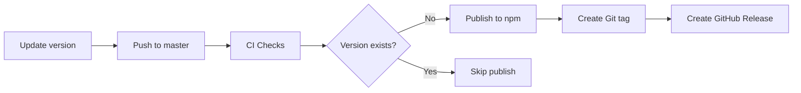

# Contributing to n8n-nodes-api-resend

Thank you for your interest in contributing! This document provides guidelines for contributing to this project.

## Development Setup

1. Clone the repository:
   ```bash
   git clone https://github.com/carlosmgv02/n8n-nodes-api-resend.git
   cd n8n-nodes-api-resend
   ```

2. Install dependencies:
   ```bash
   npm install
   ```

3. Build the project:
   ```bash
   npm run build
   ```

4. Run linter:
   ```bash
   npm run lint
   ```

## Code Quality Standards

This project maintains high code quality standards:

- ✅ No duplicate code - shared functions are in `utils/`
- ✅ All comments in English
- ✅ Magic numbers replaced with constants
- ✅ TypeScript strict mode compliance
- ✅ ESLint and Prettier formatting

## Pull Request Process

1. **Create a feature branch** from `master`:
   ```bash
   git checkout -b feature/your-feature-name
   ```

2. **Make your changes** following the code standards

3. **Test locally**:
   ```bash
   npm run lint
   npm run build
   ```

4. **Commit your changes**:
   ```bash
   git add .
   git commit -m "Description of your changes"
   ```

5. **Push and create a PR**:
   ```bash
   git push origin feature/your-feature-name
   ```

6. **Wait for CI checks** - The GitHub Actions CI workflow will automatically:
   - Run linter on Node 18.x and 20.x
   - Check code formatting
   - Build the project
   - Verify no duplicate code
   - Check for Spanish comments
   - Verify constants usage

7. **Address any CI failures** before requesting review

## Release Process

Releases are **fully automated** via GitHub Actions when changes are merged to `master`.

### How to Create a New Release

1. **Update the version** in `package.json`:
   ```bash
   # For bug fixes
   npm version patch

   # For new features (backward compatible)
   npm version minor

   # For breaking changes
   npm version major
   ```

   This will:
   - Update `package.json`
   - Create a git commit
   - Create a git tag

2. **Push to master**:
   ```bash
   git push origin master --follow-tags
   ```

3. **Automated deployment** will:
   - ✅ Run all CI checks
   - ✅ Build the project
   - ✅ Publish to npm registry
   - ✅ Create a GitHub release
   - ✅ Tag the release

### Release Workflow



### Skip CI

To skip the CI workflow (e.g., for documentation updates), include `[skip ci]` in your commit message:
```bash
git commit -m "Update README [skip ci]"
```

## GitHub Secrets Configuration

The repository owner needs to configure these secrets in GitHub:

1. **NPM_TOKEN** (Required for publishing)
   - Go to: Repository Settings → Secrets and variables → Actions
   - Create a new secret named `NPM_TOKEN`
   - Value: Your npm access token from https://www.npmjs.com/settings/[username]/tokens
   - Type: Automation token (recommended) or Publish token

2. **GITHUB_TOKEN** (Automatically provided by GitHub Actions)
   - No configuration needed

## Project Structure

```
n8n-nodes-api-resend/
├── .github/workflows/     # CI/CD pipelines
│   ├── ci.yml            # PR checks
│   └── release.yml       # npm publishing
├── nodes/Resend/
│   ├── constants.ts      # Centralized constants
│   ├── types.ts          # TypeScript interfaces
│   ├── resources/        # API resources
│   └── utils/            # Shared utilities
├── credentials/          # n8n credential definitions
└── dist/                 # Compiled output (generated)
```

## Code Standards

### Avoid Duplication

❌ **Bad** - Duplicated pagination function in each resource:
```typescript
// In emails.ts
async function preparePaginatedRequest() { ... }

// In contacts.ts
async function preparePaginatedRequest() { ... }
```

✅ **Good** - Shared function in utils:
```typescript
// In utils/requestBuilders.ts
export async function preparePaginatedRequest() { ... }

// In emails.ts, contacts.ts, etc.
import { preparePaginatedRequest } from '../utils/requestBuilders';
```

### Use Constants

❌ **Bad** - Magic numbers:
```typescript
const MAX_SIZE = 40 * 1024 * 1024; // What is this?
const limit = 20;
```

✅ **Good** - Named constants:
```typescript
import { ATTACHMENT, PAGINATION } from '../constants';

const MAX_SIZE = ATTACHMENT.MAX_SIZE_BYTES;
const limit = PAGINATION.DEFAULT_LIMIT;
```

### English Only

❌ **Bad** - Spanish comments:
```typescript
// Si hay scheduledAt, incluirlo
if (scheduledAt) { ... }
```

✅ **Good** - English comments:
```typescript
// If scheduledAt is provided, include it
if (scheduledAt) { ... }
```

## Questions?

Open an issue or reach out to [@carlosmgv02](https://github.com/carlosmgv02)
